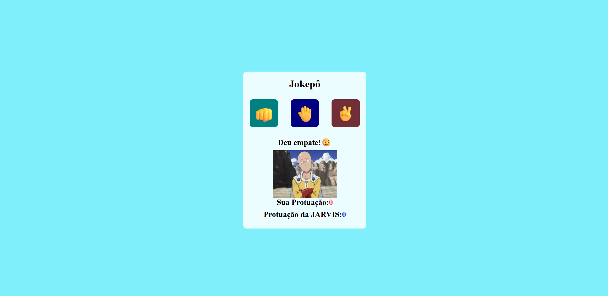

# 🎮 Jokepo - Pedra, Papel e Tesoura

Um simples jogo de **Pedra, Papel e Tesoura** feito com HTML, CSS e JavaScript, onde o jogador desafia o computador em partidas rápidas e divertidas!

## 📌 Descrição

Neste projeto, o usuário escolhe entre pedra, papel ou tesoura, e o computador faz sua escolha aleatória. Em seguida, o resultado da partida é exibido na tela: vitória, derrota ou empate.

## 🚀 Tecnologias Utilizadas

- HTML5
- CSS3
- JavaScript (puro/vanilla)

## ⚙️ Lógica do Jogo com JavaScript

O JavaScript é responsável por toda a lógica interativa do jogo:

### ✅ 1. Captura da Escolha do Jogador

Quando o jogador clica em uma opção, um **event listener** identifica qual foi a escolha:

```javascript
document.getElementById('pedra').addEventListener('click', () => jogar('pedra'));
```

### 🎲 2. Escolha Aleatória do Computador

O computador escolhe aleatoriamente entre as três opções:

```javascript
const opcoes = ['pedra', 'papel', 'tesoura'];
const escolhaComputador = opcoes[Math.floor(Math.random() * 3)];
```

### 🧠 3. Comparação e Resultado

O jogo compara a escolha do jogador com a do computador para determinar o vencedor:

```javascript
if (jogador === computador) {
  resultado = 'Empate!';
} else if (
  (jogador === 'pedra' && computador === 'tesoura') ||
  (jogador === 'papel' && computador === 'pedra') ||
  (jogador === 'tesoura' && computador === 'papel')
) {
  resultado = 'Você venceu!';
} else {
  resultado = 'Computador venceu!';
}
```

### 📺 4. Exibição do Resultado

O resultado é exibido dinamicamente na tela com JavaScript:

```javascript
document.getElementById('resultado').textContent = resultado;
```

## 📁 Estrutura do Projeto

```
Jokepo/
│
├── imag/             # Imagens usadas no jogo
├── index.html        # Estrutura HTML do jogo
├── style.css         # Estilos visuais (cores, fontes, layout)
└── scripts.js        # Lógica do jogo em JavaScript
```

## 💻 Como Rodar o Projeto

1. Clone o repositório:

```bash
git clone https://github.com/alessandroveras97/Jokepo.git
```

2. Acesse a pasta do projeto:

```bash
cd Jokepo
```

3. Abra o arquivo `index.html` com seu navegador (basta dar dois cliques ou arrastar para o navegador).

## 📷 Imagens

## 🖼️ Imagem do Jogo



## 📝 Licença

Este projeto está sob a licença MIT. Veja mais em [LICENSE](LICENSE).
